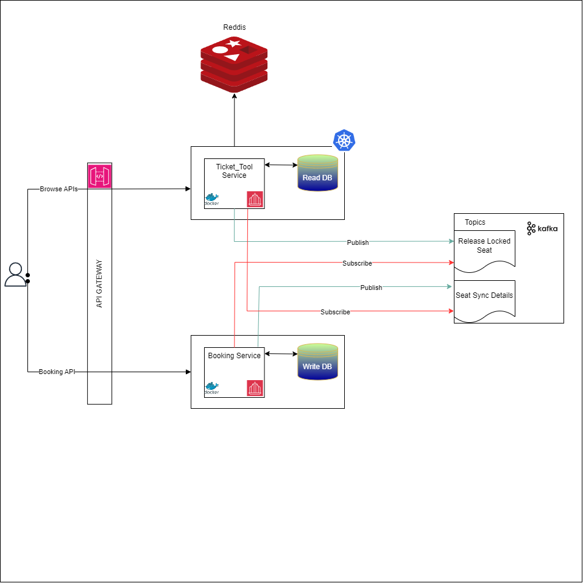

# Publicis_Sapient_Ticket_Tool
### This project is done as part of Assignment round of Publicis Sapient.

## Introduction
 Demo Project for online Ticket selling platform.

## Requirements
- A B2B platform for Theater Partners to get them access to bigger customer base

    1. TBD
-  Enable customers to browse the platform to get access to movies across different cities, languages and generes as well as book tickets in advance with a seemless experience.

## High Level Design



### Architecture Pattern: CQRS (Command Query Responsibility Segregation)

The system is split into two independent microservices that separate **read** and **write** responsibilities. Communication between them is **event-driven** using **Apache Kafka**, making the architecture resilient to temporary service outages.

---

### Microservices

| Service | Role | Port | Database |
|---|---|---|---|
| **Ticket_Tool** (Query Service) | Handles all read/browse operations | `8080` | Redis (catalogue) + H2 (seat view) |
| **Booking_Service** (Command Service) | Handles seat locking, booking & cancellation | `8081` | H2 (seat & booking - source of truth) |

---

### Data Flow

#### 1. Browse Flow (Read Path — Ticket_Tool)
```
Client → Ticket_Tool (Query Service)
            │
            ├─ Redis ← City, Event, Theatre, TheatreEvent (catalogue data)
            │
            └─ H2 (Read Replica) ← Seat, Booking (read-optimised copy)
```
- Users browse **Cities → Events → Theatres → Show Timings → Seats**.
- All catalogue data (City, Event, Theatre, TheatreEvent) is stored in **Redis** as lightweight records using `@RedisHash`.
- Seat availability is served from a **local H2 read replica** for fast response times.

#### 2. Booking Flow (Write Path — Booking_Service)
```
Client → Booking_Service (Command Service)
            │
            └─ H2 (Write DB — Source of Truth) ← Seat, Booking
```
- **Lock Seats** (`POST /seats/lock`) — Locks requested seats, creates an `INPROGRESS` booking with a 5-minute timer.
- **Confirm Booking** (`PUT /bookings/{id}/confirm`) — If within 5 min → `COMPLETE`; expired → `INCOMPLETE`.
- **Cancel Booking** (`PUT /bookings/{id}/cancel`) — Marks booking `INCOMPLETE`, releases seats.

#### 3. Sync: Write DB → Read DB (Kafka Topic: `seat-sync-events`)
```
Booking_Service ──publish──► [ seat-sync-events ] ──consume──► Ticket_Tool
   (after every write)           (Kafka Topic)              (updates read H2)
```
- After every lock/confirm/cancel, `Booking_Service` publishes the updated seat list to the `seat-sync-events` Kafka topic.
- `Ticket_Tool` consumes the event and syncs its local read H2 database.

#### 4. Lock Expiry: Read Service → Write Service (Kafka Topic: `lock-release-events`)
```
Ticket_Tool ──publish──► [ lock-release-events ] ──consume──► Booking_Service
 (on read, if locks       (Kafka Topic)                     (releases in write DB,
  expired > 5 min)                                           syncs back via topic 1)
```
- When a user fetches seats, the Query service **optimistically releases expired locks** in the read DB for instant feedback.
- It then publishes the **specific seat IDs** to `lock-release-events`.
- The Command service consumes these, releases locks in the write DB, marks bookings `INCOMPLETE`, and syncs changes back through `seat-sync-events`.

---

### Key Design Decisions

| Decision | Rationale |
|---|---|
| **CQRS** | Read-heavy workload (browsing) is decoupled from write-heavy workload (booking), allowing independent scaling. |
| **Kafka over REST** | If the Command service is temporarily down, lock-release messages stay in the queue and are processed on recovery — no data loss. |
| **Optimistic lock release** | Users see expired seats as available immediately without waiting for cross-service round-trip. |
| **Seat-level lock events** | Lock-release events carry specific seat IDs, not entire theatre-event IDs, for precise and efficient processing. |
| **Redis for catalogue** | Catalogue data (cities, events, theatres) is read-heavy and semi-static — ideal for Redis. |
| **H2 for seats/bookings** | Seat state requires transactions (lock, book, release) — relational DB with JPA provides ACID guarantees. |
| **5-minute lock TTL** | Prevents abandoned carts from indefinitely blocking seats. |

---

### Technology Stack

| Layer | Technology |
|---|---|
| Language | Java 17 |
| Framework | Spring Boot 4.x |
| Catalogue Store | Spring Data Redis |
| Transactional Store | Spring Data JPA + H2 |
| Messaging | Apache Kafka (spring-kafka) |
| Build | Maven |

---

## Transactional Scenarios & Design Decisions

| # | Scenario | Risk | Design Decision | Guarantee |
|---|---|---|---|---|
| 1 | Two users lock same seat | Double-booking | `@Transactional` with fail-fast status check | Strong (single DB) |
| 2 | User abandons after locking | Seats blocked forever | 5-min TTL, lazy release on read, Kafka sync to write | Eventual |
| 3 | User confirms after lock expires | Pay for released seats | Re-check expiry at confirmation time | Strong (single DB) |
| 4 | Some seats in batch unavailable | Partial lock | All-or-nothing rollback | Strong (single DB) |
| 5 | Read DB out of sync with write DB | Stale availability | Eventual consistency via Kafka events | Eventual |
| 6 | Kafka unavailable | Sync lost | Write DB = source of truth, idempotent operations | Eventual + manual |

